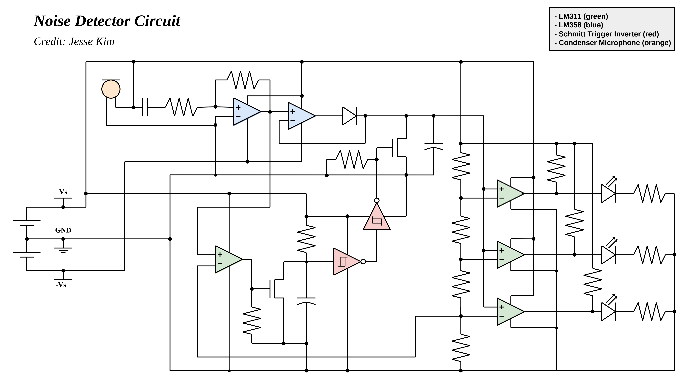
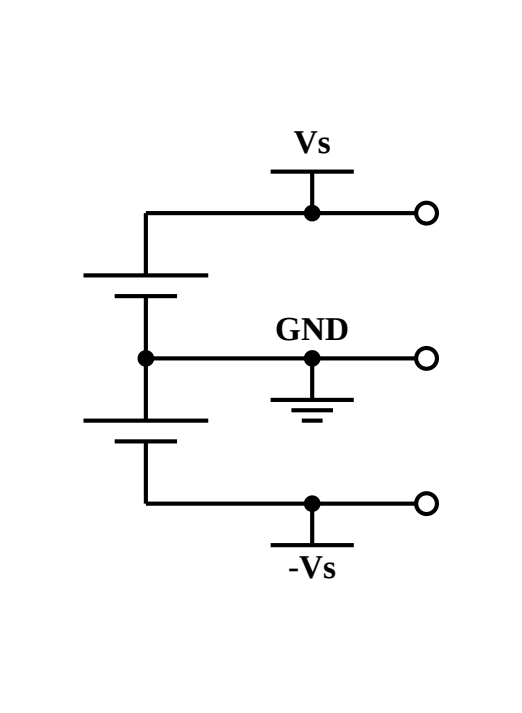
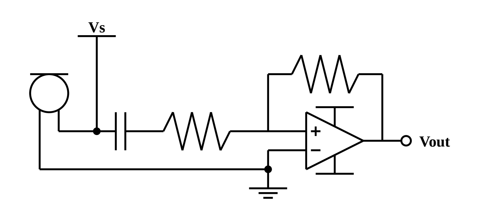
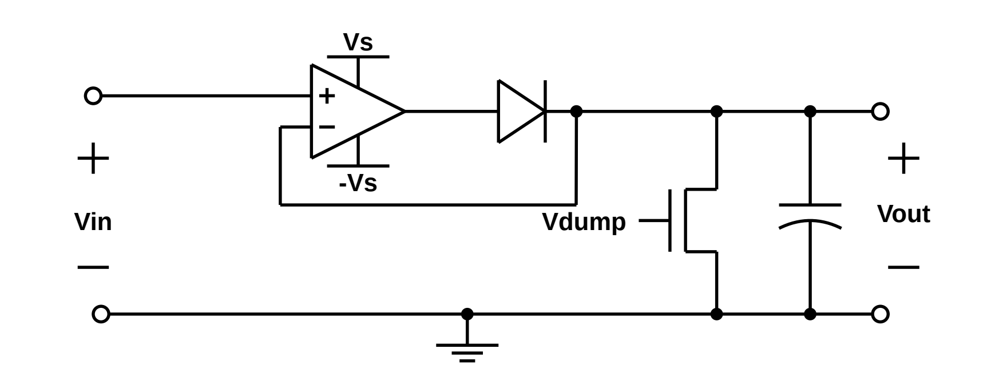
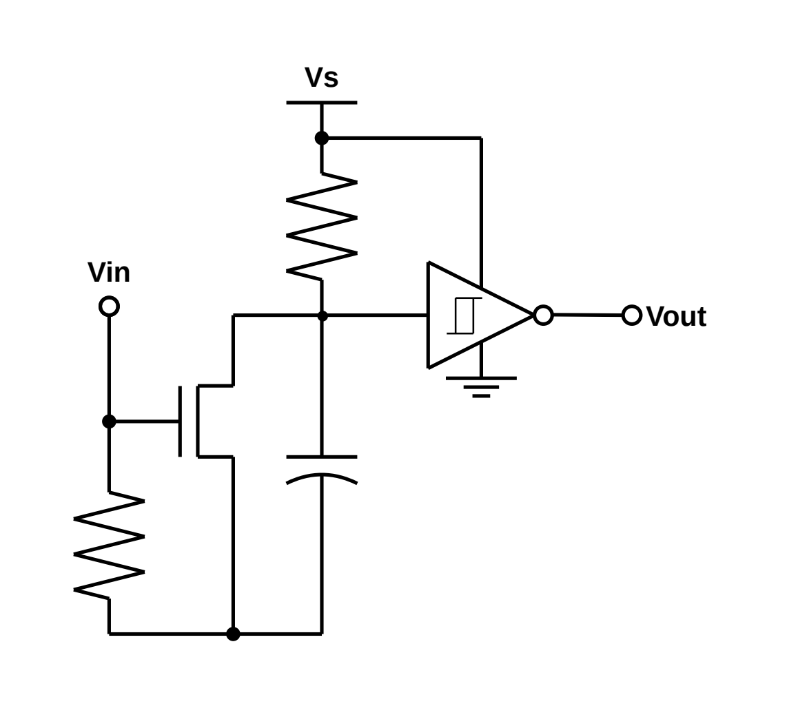
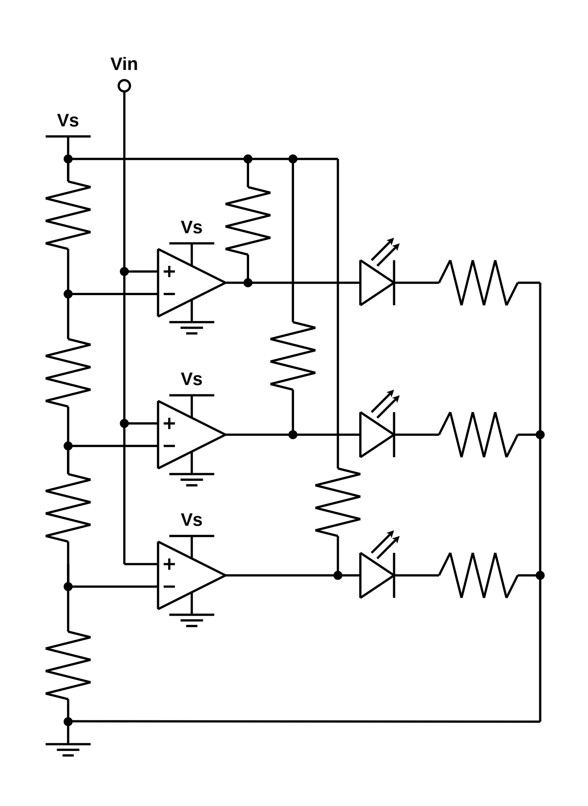
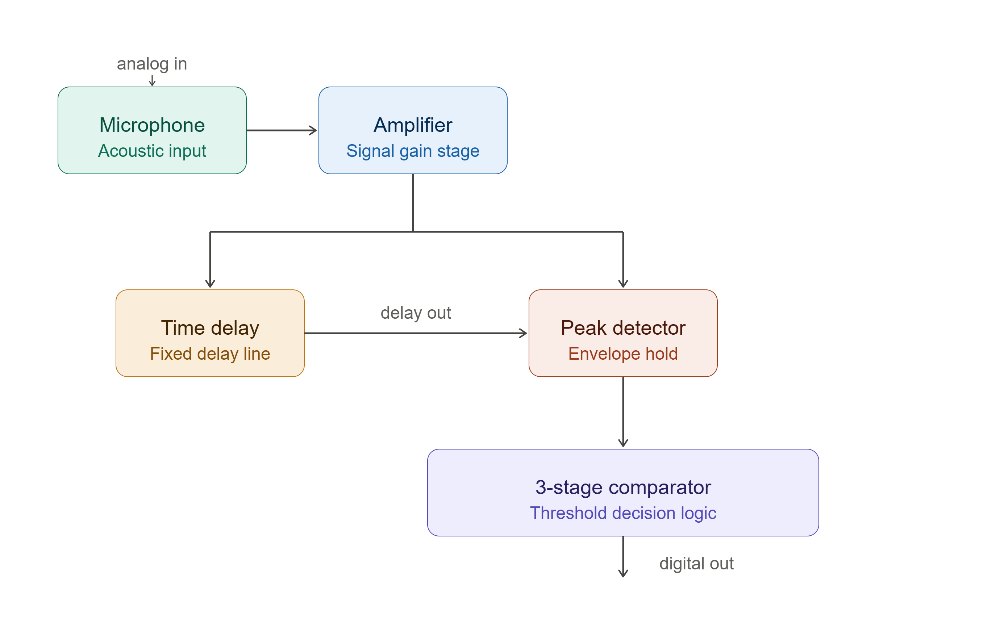
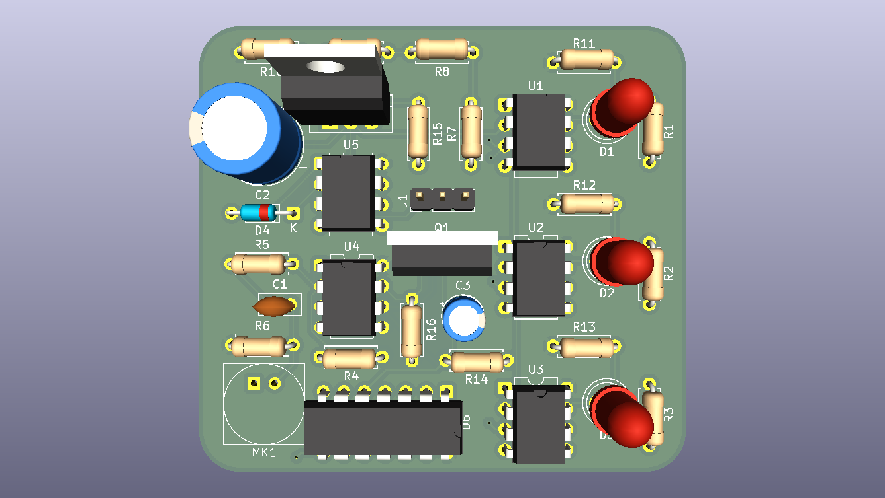

# Noise Detector PCB

This document is an in-depth description and documentation of the Noise Detector PCB which I designed from scratch.

## Table of Contents
- [Overview](#overview)
- [Circuit](#circuit)
  - [Power Supply](#power-supply) 
  - [Microphone and Amplifier](#microphone-and-amplifier)
  - [Peak Detector](#peak-detector)
  - [RC Time Delay](#rc-time-delay)
  - [3-stage Comparator](#3-stage-comparator)
  - [Final Circuit](#final-circuit)
- [PCB](#pcb)

## Overview

The following documentation is a full explanation and walk through of my Noise Detector PCB, an analog circuit. 

The circuit includes an analog signal chain (amplification → peak detection → timed delay → threshold comparison). The components include a condenser microphone, LM358 op-amp, LM311 comparator, and a Schmitt Trigger Inverter. 

The design includes an NMOS-switched peak detector, an RC hold time delay circuit to capture audio peak for a set time, and a 3-level voltage comparator network that connects to a 3-level LED volume indicator.

## Circuit

### Power Supply

All components in this circuit require a +9V, GND, and -9V. This is created by wiring two 9V batteries in series, creating an 18V difference between the two, and setting the GND to the point inbetween the batteries, creating +9V, 0V, and -9V. 

### Microphone and Amplifier

The Condenser Microphone simply converts sound into an electric signal. Sound comes into the microphone and vibrates a diaphragm which creates an induced current. This current is then used to compute a voltage which is the signal we are measuring.

However, for this circuit component the voltage signal amplitude is far too small to read, thus we need to amplify the signal. For this I used an inverting amplifier based on an LM358 OpAmp. The amplification is defined as R2/R1, where R2 is the feedback resistor. This is also known as the gain, in which I chose to use a gain of 100k/47 = 2127.66.  

### Peak Detector

The peak detector module is designed to capture the maximum amplitude of voltage input from a time-varying signal. It does this by using an LM358 OpAmp, which when applying nodal analysis, we can considered the + and - inputs to have the same voltage. In this way connecting the output of the OpAmp to the inverting input creates a voltage follower circuit. 

We can extend the design of the voltage follower input by adding a capacitor and diode such that the capacitor charges up to match the maximum voltage amplitude, but has no route to drain on its own. We add an NMOS switch to drain the capacitor, acting as a reset. 

### RC Time Delay

The time delay module provides a controlled delay signal using an RC circuit. This provides our circuit with a fixed time which controls the duration the LEDs remain lit after the initial trigger.

The time delay first uses a comparator that compares the input signal to a voltage threshold. If the signal exceeds that threshold, the time delay begins. 

By default the capacitor is fully charged as it has an RC path to Vs, our voltage source. When the threshold is met, an NMOS is switched on, connecting the capacitor to GND, instantly draining it. The capacitor then takes time to recharge, which can be modeled by a commonly known differential equation. 

The output of this time delay is fed into a schmitt trigger inverter, which outputs high while the capacitor voltage is below a threshold. I fed this into another inverter, such that the output can reset the peak detector once the RC is above that threshold. 

### 3-stage Comparator

The 3-stage comparator simply uses a resistor/potentiometer network, that acts as a voltage divider, and 3 LM311 high speed comparators to create the module. This compares the output of the peak detector, or our max voltage, and controls a 3-level LED display, indicating volume. 

### Final Circuit

The diagram above describes the analog signal chain used to connect all submodules. The microphone output feeds into the amp, which feeds into the peak detector and time delay. The time delay control the reset of the peak detector and the peak detector output feeds into the comparator. 

The final circuit diagram is shown below

## PCB

The final circuit was then converted into a PCB design in KiCAD. The design uses a 2-layer PCB, and follows the same circuit design described as above. The PCB passed all design rules checks. The majority of optimizations were in reduce trace length.

